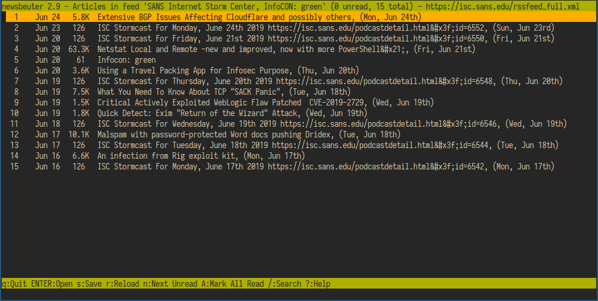
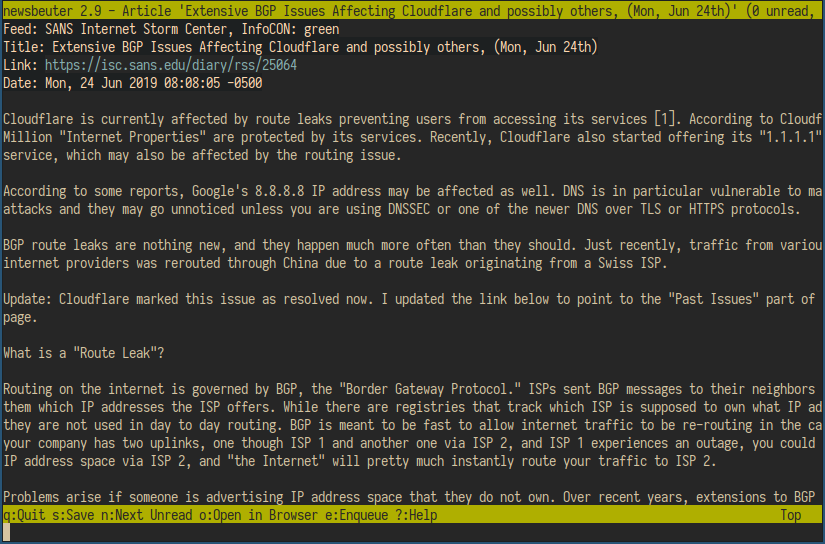

newsbeuter is a console-based RSS reader. It looks and feels very similar to mutt, so if you like 
mutt for email you should take a look at newsbeuter for your RSS-feed-reading needs.

Like mutt, newsbeuter can be themed. I have landed on a dark gruvbox theme for pretty much everything
and wanted newsbeuter to match my mutt and weechat. 

You can drop the config file into your .newsbeuter directory and tweak it as needed.

Full newsbeuter docs are here:
https://www.newsbeuter.org/doc/newsbeuter.html#_configuring_colors

Gruvbox color codes:
https://github.com/morhetz/gruvbox

List of articles

Reading an article

